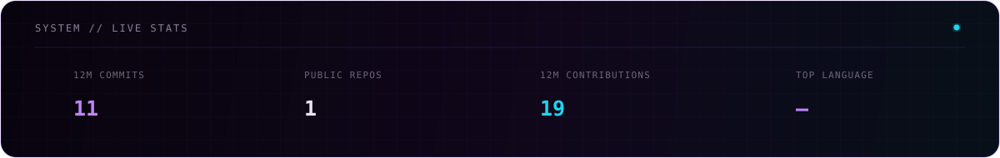
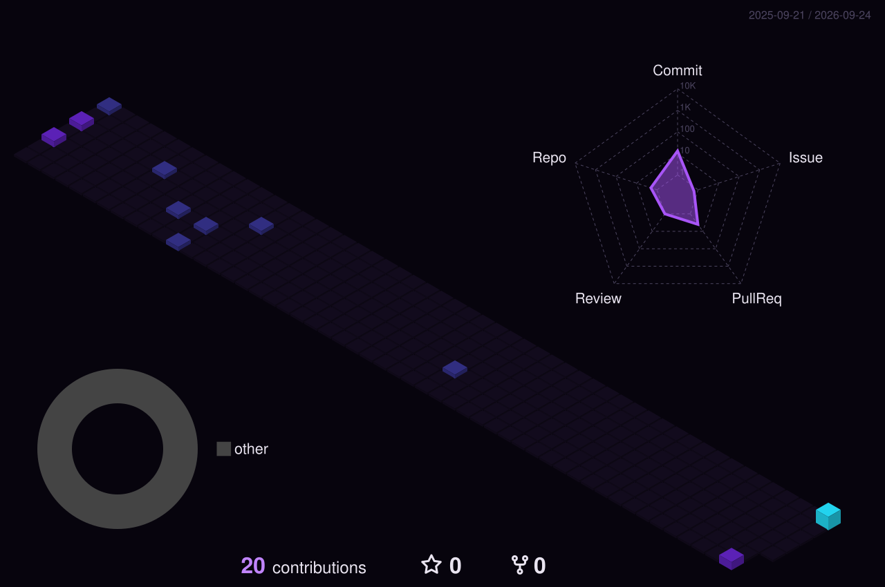

<p align="center">
  
</p>

<p align="center">
  
  
  
  
  
  
  <br/>
  
  
  
  
  
  
  <br/>
  
  
  
</p>

## // ОБО МНЕ

**Разработчик ПО** с основным фокусом на **backend**, **full-stack разработке** и **AI-системах**.

Сейчас чаще всего пишу на **Python**. Для веб-проектов предпочитаю связку **Go + Angular**. Также работал с **C#**, **C++**, **JavaScript / TypeScript** и **React**.

Активно использую современные AI-инструменты в разработке, работал с **AI API**, **локальными моделями** и **агентными системами**. Есть опыт внедрения AI-функций непосредственно в собственные проекты.

```text
СЕЙЧАС В ФОКУСЕ
├─ backend-архитектура и API
├─ full-stack веб-разработка
├─ агентные AI-системы
├─ интеграция AI и локальных моделей
└─ автоматизация
```

## // ПРОЕКТЫ

### Публичные

**[ToToDo](https://github.com/YSimatov/ToToDo/tree/completed-project)**

### Пока не опубликованы

> **Платформа для совместной работы с базой знаний**  
> Работа с контентом в реальном времени, backend на Go, web-клиент, PostgreSQL, WebSocket-синхронизация и AI-интеграция.

> **Full-stack система для бизнес-процессов**  
> Angular + C#/.NET + PostgreSQL, авторизация, несколько backend-сервисов, API gateway и контейнеризация.

> **Учебная платформа**  
> Full-stack система с ролями пользователей, учебными материалами, тестами, экзаменами, историей результатов и административной частью.

> **Асинхронный сканер рыночных данных**  
> Python-сервис для асинхронного сбора и анализа market/order-book данных с контролем concurrency и тестовым покрытием.

`Дальше больше...`

## // СТАТИСТИКА

<p align="center">
  
</p>

## // 3D-КАРТА АКТИВНОСТИ

<p align="center">
  
</p>

## // СВЯЗЬ

<p align="center">
  <a href="https://t.me/ysimatov">
    
  </a>
</p>
